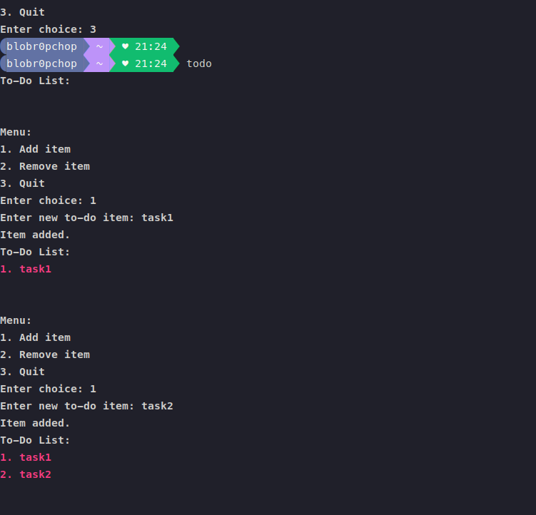

# terminal_todo

a terminal todo list app for Linux 

## Requirements:

- Python3

### Screenshots:

<div>

</div>

### Installation:

Just run the **install.py** 

```bash
python3 install.py
```

to run the app from any as shown in the above screenshot add your user directory ie **"~/"** to your path variable
